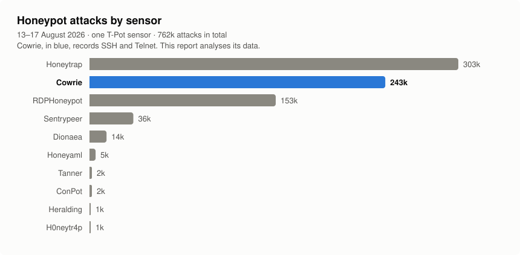

# T-Pot Honeypot Analysis

Analysis of attack data from a single T-Pot honeypot sensor, 13–17 August 2026.
A honeypot is a machine that is exposed to the internet on purpose, so that
attacks against it can be recorded safely.

The sensor recorded roughly 762,000 attacks over the five days, spread across
ten honeypot services. Each service is analysed in its own folder.

## Contents

| Folder | Sensor | Events | Status |
|---|---|---|---|
| [`cowrie/`](cowrie/) | SSH and Telnet | 243k | Analysis complete |
| [`dionaea/`](dionaea/) | SMB, FTP, MySQL, MSSQL, MongoDB, PPTP | 14k | Analysis complete (readable subset — see below) |

**[`cowrie/`](cowrie/)** holds the main report. It asks how many separate
attackers are really behind the traffic, and finds that 50,345 SSH sessions
from thousands of addresses resolve to about six attack tools. It also contains
the indicators — addresses, fingerprints, file hashes and keys — as CSV, in
[`cowrie/indicators/`](cowrie/indicators/).

**[`dionaea/`](dionaea/)** covers the malware-collection sensor. It asks what
actually gets deposited on an exposed Windows file share, and finds that all 55
captured samples are the same 2017 ransomware worm still circulating unattended.
It also carries the YARA detection rules for every malware family the honeypot
caught, in [`dionaea/detection-rules.yara`](dionaea/detection-rules.yara), and
its indicators in [`dionaea/indicators/`](dionaea/indicators/).

**One caveat on that report.** It analyses roughly thirteen hours of 17 August —
990 connection events — not the full five-day window behind the 14k figure
above. The rotated log archives and the sensor's SQLite database could not be
read with the tooling available. This is the retention design working as
intended rather than data loss, but every figure in that report is scoped to
the readable subset and should not be read as characterising the full window.

## Scope

One sensor, five days, passive collection only. Nothing was scanned, probed or
contacted. All enrichment used passive sources: registry records, Team Cymru
DNS, and historical Shodan data. No malware binaries and no captured private
keys are committed to this repository.

The sensor's identity is removed throughout — not only its IP address but its
hostname, administrative username, non-standard SSH port and hosting provider.
Together those would link this analysis to the account that pays for the
machine. Note that raw honeypot data contains these values even where the
analysis does not: at least one FTP scanner probe echoes the sensor's public
address back at it. Re-check before publishing any further raw extract.
